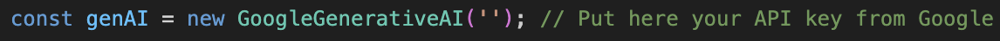

# Mentor AI - o guia para devs juniores

Projeto desenvolvido para a Imersão AI Alura + Google Gemini

## Como rodar o projeto

Basta fazer o clone do projeto e em seu terminal rodar o seguinte comando
`yarn && yarn dev` ou `npm install && npm run dev`

## Criação da API key

Para que o projeto rode corretamente, é necessário que você insira sua chave de API para poder utilizar os poderes do Gemini. Como essa chave é um valor sensível e esse projeto é apenas uma idealização e prototipação, deixei para que cada um insira a sua.
Para criar a sua chave você pode acessar o guia feito pela Alura em https://www.youtube.com/watch?v=5TNzbqMM_2k

#### Uso da API key no projeto

Tendo copiado a sua chave, basta acessar seu App.jsx e no local onde é feito a inicialização do GoogleGenerativeAI, coloque a dentro das aspas:

## Explicação do projeto

Em determinado momento da vida de um desenvolvedor, chega o momento em que ele quer evoluir do nível em que ele, seja de júnior para pleno ou pleno para sênior. Mas, as vezes com tanta informação que temos hoje em dia esse desenvolvedor pode se sentir perdido no que focar, no que estudar e como chegar a um próximo nível.
Desta forma, nesse projeto é utilizada a API do Gemini para criar um Mentor AI, cujo propósito é trazer um relatório, o qual pode ser feito download como um arquivo PDF no final. Para início, é solicitado alguns dados para que o Mentor possa traçar um bom plano de desenvolvimento, como o tempo de experiência desse dev, em quais linguagens ele já possui conhecimentos e para qual linguagens e tecnologias ele se vê usando como sênior. Com isso, o Mentor cria o relatório, sempre com uma pitada de humor, as lacunas para que esse dev chegue ao nível maior e um plano detalhado, dividindo em seções de acordo com as linguagens e tecnologias informadas. Além disso, o Mentor indica livros, cursos na internet e documentações para guiá-lo. Por fim, traz uma mensagem do papel de um sênior para a área informada.
